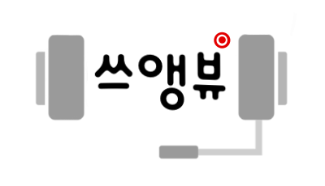
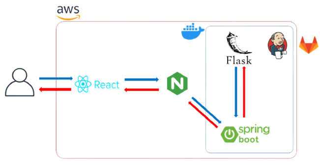
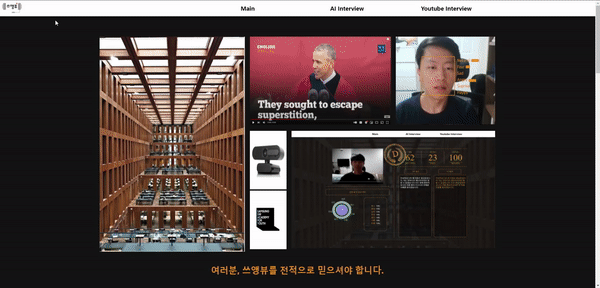
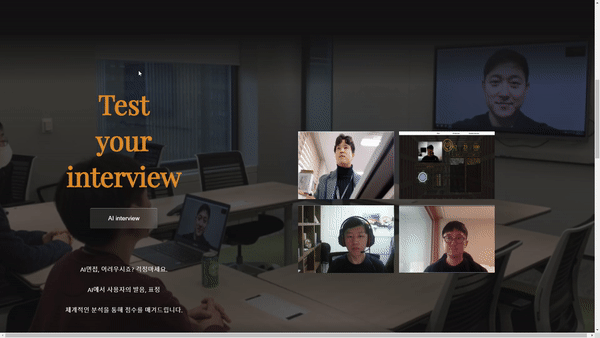
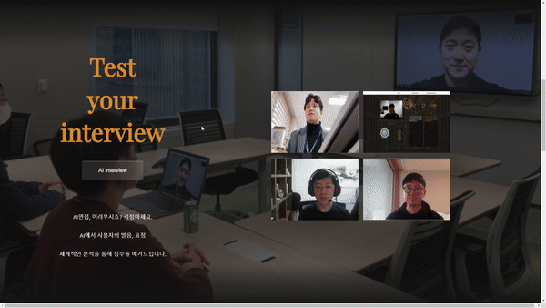
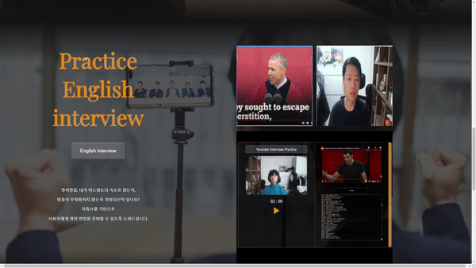

# 쓰앵뷰

> 화상 면접 및 영어 면접  + 유튜브 활용 쉐도잉 연습용 웹사이트

비대면 화상 면접이 늘어난 만큼 화상면접을 대비할 수 있는 서비스.

이외에도 영어 면접 및 유튜브를 활용한 쉐도잉 연습으로 발음 교정에도 활용할 수 있다. 

감정분석 및 STT(Sppech-To-Text)를 통해 자가체크를 할 수 있도록 결과 리포트를 제공한다. 

서비스 URL : https://k5b103.p.ssafy.io/ (배포중단)

## 프로젝트 진행 소개

- 팀원 : 5명 (프론트엔드: 3명, 백엔드: 2명)
- 프로젝트 기간: 2021.10.11 ~ 2021.11.26
- 내가 담당한 부분
  - CI/CD
  - [STT스크립트 유사도 측정 및 API 구현](https://github.com/juyongc/PJT_SSUVIEW/blob/main/backend/src/main/java/com/interview/service/SttService.java)

## 주요 기능

| 구분 | 기능                      | 설명                                                         |
| ---- | ------------------------- | ------------------------------------------------------------ |
| 1    | 한/영 화상 면접 연습 기능 | 사용자가 Script를 작성을 하고, STT(Speech-To-Text)와 비교를 통해 발음 정확도를 진행한다. |
| 2    | 화상 면접 시 얼굴 인식    | 얼굴 이미지를 캡쳐하고 감정분석 후, 결과를 보여준다          |
| 3    | 유튜브 활용 영어 연습     | 인기있는 TED 유튜브 영상 및 영어 자막을 활용하여 쉐도잉 연습을 진행한다. |

## 구조도

## 사용 예시

**[메인 화면]**

**[ 화상 면접 - 한국어]**

**[ 화상 면접 - 영어 ]**

**[ Youtube 영어 쉐도잉 연습 ]**

