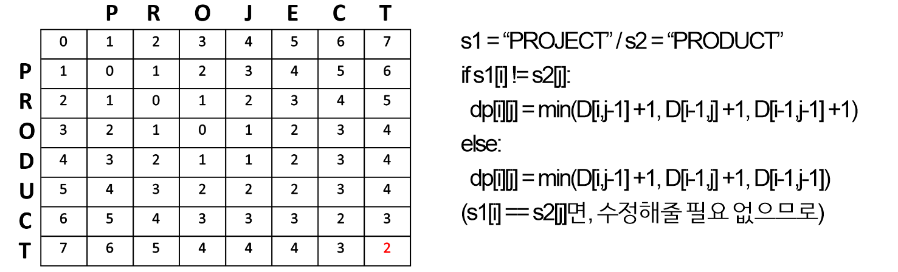

# 쓰앵뷰

> 화상 면접 및 영어 면접  + 유튜브 활용 쉐도잉 연습용 웹사이트

비대면 화상 면접이 늘어난 만큼 화상면접을 대비할 수 있는 서비스.

감정 분석 및 발음 정확도 측정으로 자가 체크를 할 수 있도록 결과 리포트를 제공한다. 

이외에도 영어 면접 및 유튜브를 활용한 쉐도잉 연습으로 발음 교정에도 활용할 수 있다. 

서비스 URL : https://k5b103.p.ssafy.io (배포중단)

## 프로젝트 진행 소개

- 팀원 : 5명 (프론트엔드: 3명, 백엔드: 2명)
- 프로젝트 기간: 2021.10.11 ~ 2021.11.26
- 활용 기술

  개발: Spring boot, Flask, React.js

  배포: AWS EC2, Docker, Jenkins, Nginx
- 내가 담당한 부분
  - [CI/CD](https://github.com/juyongc/PJT_SSUVIEW/blob/main/cicd/CICD%20%EA%B3%BC%EC%A0%95.md)
  - [백엔드 개발 - 발음 정확도 측정 및 API 구현](https://github.com/juyongc/PJT_SSUVIEW/blob/main/backend/src/main/java/com/interview/service/SttService.java)

## 주요 기능

| 구분 | 기능                  | 설명                                                         |
| ---- | --------------------- | ------------------------------------------------------------ |
| 1    | 발음 정확도 측정 기능 | 사용자가 작성한 스크립트와 음성 인식 결과 비교를 통해 발음 정확도를 측정한다. |
| 2    | 감정 분석             | 화상 면접 시 얼굴 이미지를 캡쳐하여 감정 분석하고 점수를 반환한다. |
| 3    | 유튜브 활용 영어 연습 | TED 유튜브 영상 및 영어 자막을 활용하여 쉐도잉 연습을 할 수 있다. |

## 담당했던 부분 및 회고

### 발음 정확도 측정 및 API 개발

- 사용자가 잘못말한 단어 위치 반환하기(최소 편집 거리 알고리즘 + STT의 잘못된 띄어쓰기 보정)

  

  - 문자의 삽입 / 삭제 / 수정값을 비교해서 가장 작은 값을 구함

  - 위 예시에서는 J => D, E => U로 수정하면 같아지므로 편집 거리 = 2

  - STT는 외부 라이브러리를 사용했는데, 잘못된 띄어쓰기로 반환해서 오차가 발생

    => 일정 유사도 이하면 띄어쓰기로 인한 문제인지 확인하기 위해 다음 단어와 합한 뒤, 재비교

  - ex) “선택하신다면”을 “선택 하신다면”으로 반환하면, “선택” + “하신다면”을 합해서 

    “선택하신다면”으로 다시 비교하도록 만듦

    

### 배포

- Docker, Jenkins 사용한 빌드, 배포 자동화 구현
  - Gitlab에 변경된 내용 있으면 자동으로 webhook
  - Jenkins 파이프라인 설정으로 git clone, build, 배포까지 자동화 구현

- SSL 적용으로 보안 강화
- Nginx로 http 요청을 https로 자동 변경 & 오류 페이지 보여주기

### 운영 중 개선 사항

- 413 에러(Entity too large) 개선

  - 발생 원인

    Nginx에서 일정 용량 이상의 요청은 보내지 못하도록 제한함. 

    현 프로젝트에서 감정분석을 위해 사용자의 이미지를 매초 캡쳐하는데 시간이 지날수록 용량이 많아져서 생긴 문제

  - 해결 방법

    Nginx에 client_max_body_size 크기 증가 & 최대 사용 시간 2분으로 설정

### 기타

- 첫 배포였던 만큼 많이 헤맸던 것 같다.

  더 공부해서 무중단 배포도 진행해보면 좋을 것 같다.

## 구조도

## 사용 예시

**[메인 화면]**

**[ 화상 면접 - 한국어]**

**[ 화상 면접 - 영어 ]**

**[ Youtube 영어 쉐도잉 연습 ]**

